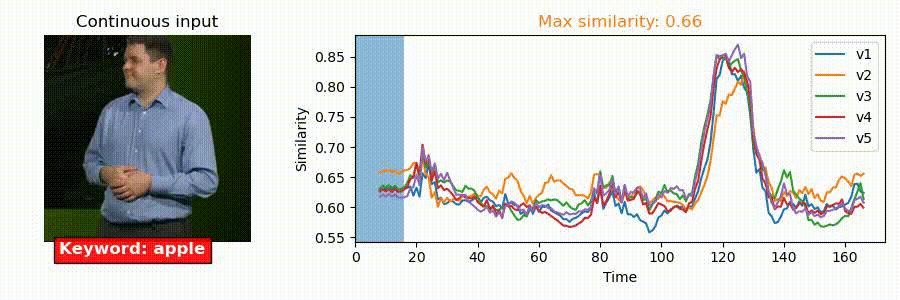
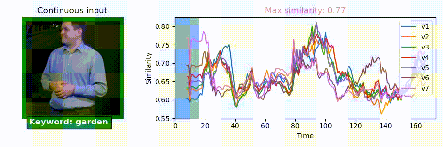
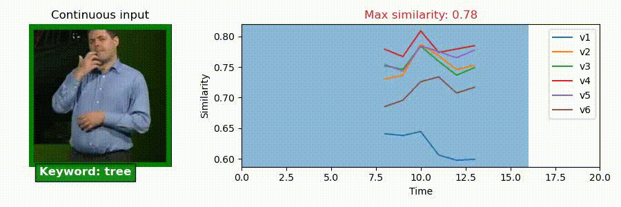
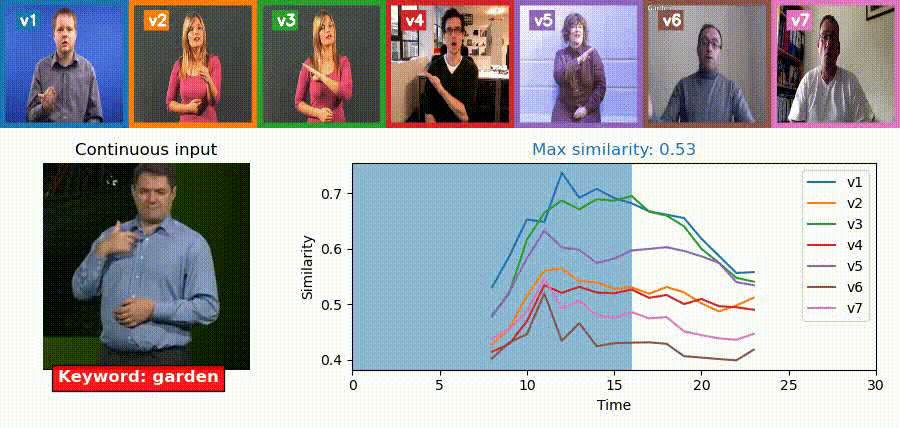
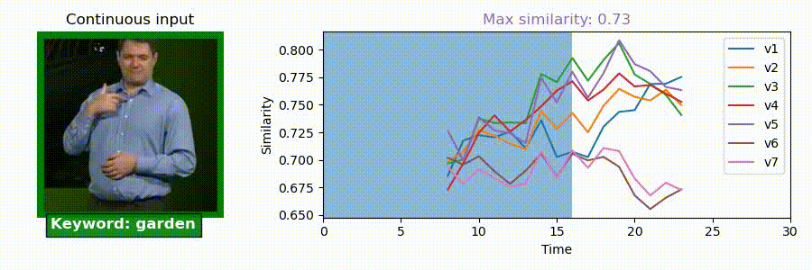

# BSLDict models comparaison

Here we present and compare different models according to different training.
We will show results based on a first long signing video input that contains
signs _apple_, _tree_ and _garden_. Then, we will compare models with a short input
with a single of these words directly extracted from the long video.

All these results have generated with the code from `demo/demo.py` for I3D + MLP, otherwise `reverse_video_search/demo.py`.

Here are the different models
* I3D + MLP : superposition of I3D and MLP, loaded from `models/i3d_mpl.pth.tar`,
* I3D : the same I3D as before but embeds from I3D, loaded from `models/i3d_mpl.pth.tar`,
* BOBSL_I3D : a new I3D trained from BSLDict and BOBSL dataset, loaded from `models/bobls_i3d.pth.tar`,
* BSL1K_I3D : a new I3D trained from BSLDict and BSL1K dataset, loaded from `models/bsl1k_i3d.pth.tar`.

>Note that some layers are unsed/missing. Click [**here**](unused_missingLayers.md) for more details.

In the following, the models will be presented in the following order :
1. I3D + MLP
2. I3D alone (extracted from I3D + MLP)
3. BOBSL_I3D
4. BSL1K_I3D

## Comparison of the models on a long video

---

### Sign _apple_

### Signe _tree_

### Signe _garden_

## Comparison of the models on short videos

---

### Sign _apple_

### Signe _tree_

### Signe _garden_

